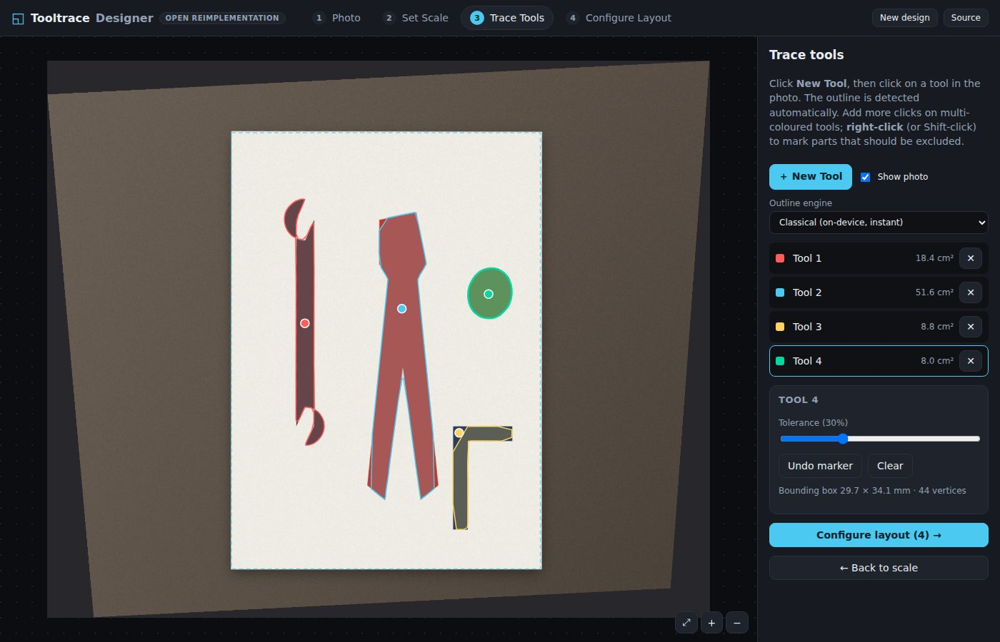
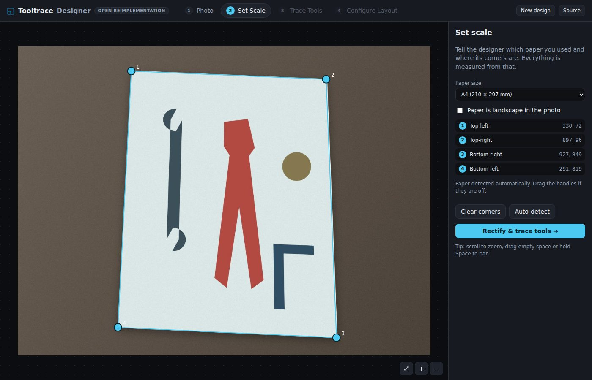
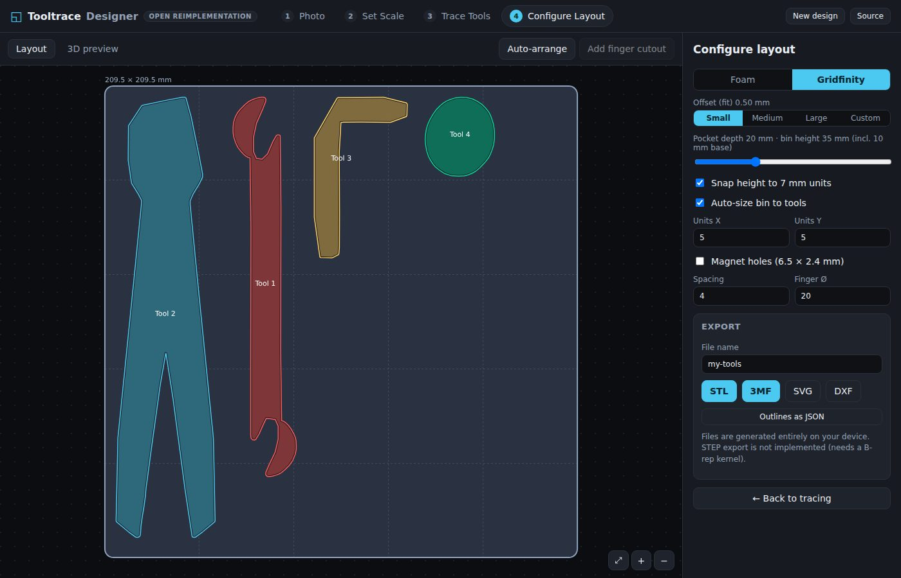
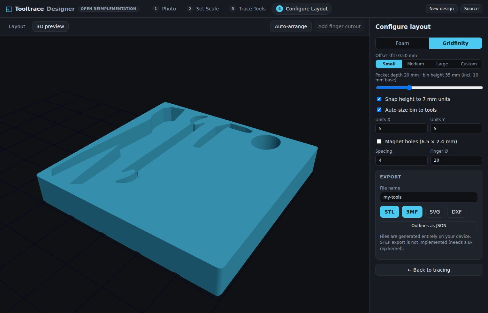

# Tooltrace Designer (open reimplementation)

A from-scratch, client-only rebuild of the workflow behind
[tooltrace.ai/designer](https://www.tooltrace.ai/designer): photograph your tools on a sheet
of paper, click each tool to trace it, arrange the outlines, and export a shadowbox-foam cut
file (DXF / SVG) or a Gridfinity insert (STL / 3MF).

Everything runs in the browser. No account, no server, no uploads.



| Set scale | Configure layout | 3D preview |
| --- | --- | --- |
|  |  |  |

## Workflow

1. **Photo.** Drop in a top-down photo with an A4 / Letter sheet in frame (or click *Try a demo photo*).
2. **Set scale.** The paper corners are detected automatically; drag the handles if needed and pick the paper size. The photo is rectified with a homography so every pixel has a known size in millimetres, including tools lying next to the sheet.
3. **Trace tools.** *New Tool*, then click on a tool. The outline is segmented, cleaned, simplified and smoothed. Add more clicks for multi-coloured tools; right-click to exclude a region. Tolerance is adjustable per tool.
4. **Configure layout.** Pick *Foam* or *Gridfinity*, choose the fit offset (small / medium / large / custom), pocket depth, bin units (auto or manual), magnet holes, sheet size, spacing and finger cutouts. Drag, rotate and nudge tools; *Auto-arrange* packs them. The 3D tab previews the actual export mesh.
5. **Export.** STL / 3MF for printing, DXF / SVG for laser / CNC, or JSON outlines.

## Development

```bash
npm install
npm run dev        # http://localhost:5173
npm test           # vitest unit tests (geometry, image pipeline, exporters, mesh watertightness)
npm run build      # typecheck + production bundle in dist/
```

### Outline engines

* **Classical (default):** estimates the paper colour, thresholds colour distance, cleans the mask morphologically, and takes the connected component under each click. Runs in a Web Worker in well under a second. Best with dark tools on white paper, which is the use case.
* **Neural (optional):** SlimSAM through transformers.js, loaded on demand from a CDN into the same worker. Handles low-contrast tools, at the cost of a ~40 MB download and a few seconds of compute per image. Falls back to the classical engine if it cannot load.

### Layout

```
src/
  lib/
    geometry.ts        points, polygons, RDP simplification, Chaikin smoothing
    homography.ts      4-point DLT homography, inverse, corner ordering
    warp.ts            perspective rectification of the whole photo into mm space
    paper.ts           paper sizes, automatic paper-corner detection
    contour.ts         binary mask morphology, hole filling, Moore contour tracing, rasterisation
    segment/           Segmenter interface: classical.ts, sam.ts
    offset.ts          Clipper wrapper: offset (round joins), union, difference, intersection
    layout.ts          Gridfinity constants, foam settings, shelf packing
    build.ts           design assembly (clipping, overlap checks) and file export
    export/            svg.ts, dxf.ts, mesh.ts (watertight extrusions + Gridfinity base), stl.ts, threemf.ts
  worker/              image worker (detect / rectify / segment) and typed client
  state/store.ts       zustand store (steps, tools, placements, settings)
  components/          CanvasStage (pan/zoom), PhotoStep, ScaleStep, TraceStep, LayoutStep, Preview3D
tests/                 vitest suites
docs/REVERSE_ENGINEERING.md   what was inferred about the original and how
```

## How faithful is this?

See [docs/REVERSE_ENGINEERING.md](docs/REVERSE_ENGINEERING.md). In short: the workflow, controls,
Gridfinity geometry and export formats follow the published documentation and reviews of the
original; the original site could not be fetched from the build environment, so no code, assets
or exact numeric defaults were copied. STEP export, accounts and billing are not reproduced.

## License

MIT. Gridfinity is an open standard by Zack Freedman. "Tooltrace" is the name of the original
product; this project is an independent reimplementation and is not affiliated with it.
